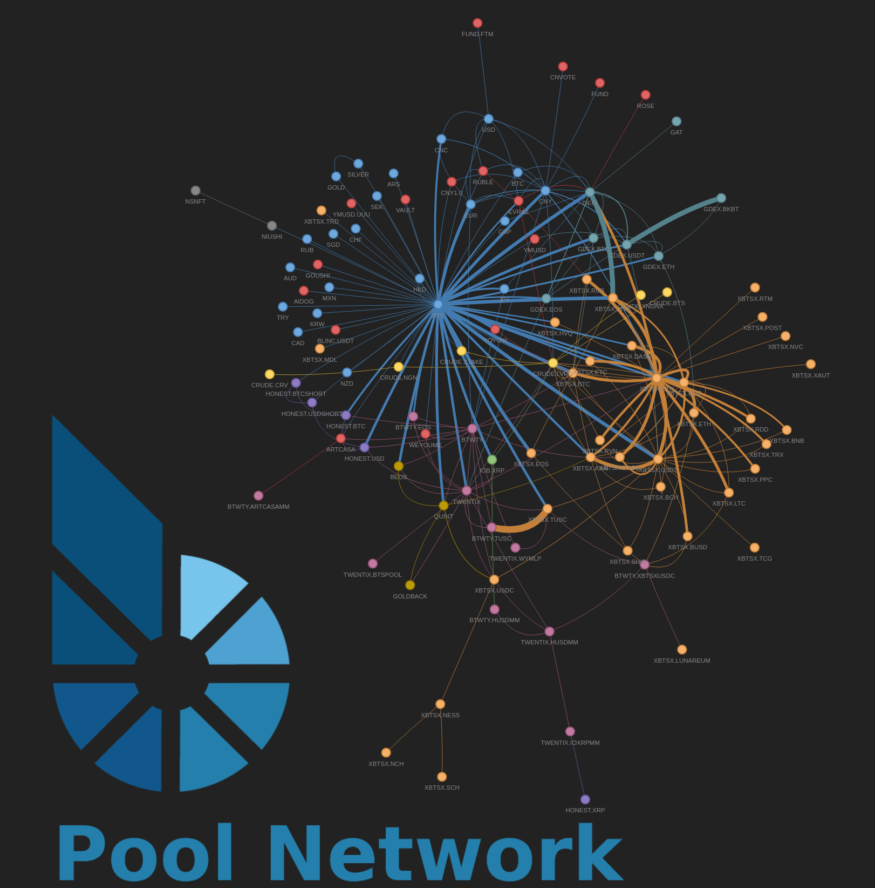

# Bitshares Networks

The app uses vector graphics, so you can zoom in. You can also untangle and drag the network, select only one node, and grey out all non-connected nodes.

## Liquidity Pool Visualizer

Installation:

 - Download the repository zip and extract (or `git clone`)

 - `cd` into the repository

 - `pip3 -r requirements.txt`

 - `cd pools`

 - `python3 pool_mapper.py`

Hovering over a node provides pricing information relative to BTS, BTC, and USD, as well as the asset ID. Hovering over a network link brings up the A and B balances and the pool price, as well as the pool share ID and name. There are some configuration options to detach unfunded pools or detach specific pools, as well as an option to only attach specific pools. A minimal GUI provides some controls over the node, edge, and physics of the app.

</img>

## Orderbook Visualizer

`# TODO`

## Transfers Visualizer

`# TODO`
